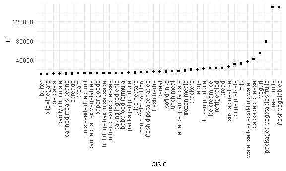
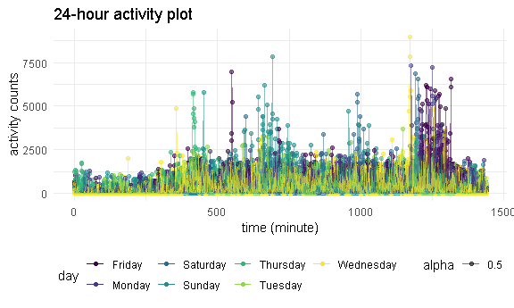
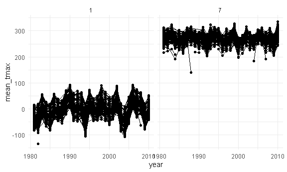
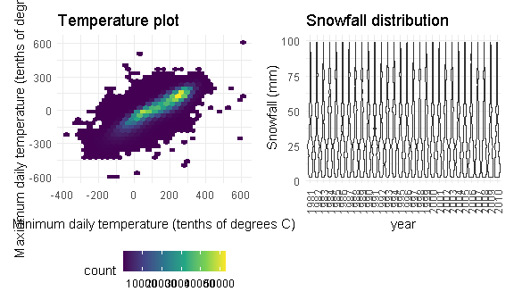

Homework 3 solutions
================
Yali Zhai
2020-10-11

install.packages(“devtools”) install.packages(“hexbin”)
devtools::install\_github(“p8105/p8105.datasets”) —

### Problem 1

``` r
data("instacart")
```

This dataset contains 1384617 rows and 15 columns.

Observations are the level of items in orders by user. There are user /
order variables – user ID, order ID, order day, and order hour. There
are also item variables – name, aisle, department, and some numeric
codes.

How many aisles, and which are most items from?

``` r
instacart %>% 
    count(aisle) %>% 
    arrange(desc(n))
```

    ## # A tibble: 134 x 2
    ##    aisle                              n
    ##    <chr>                          <int>
    ##  1 fresh vegetables              150609
    ##  2 fresh fruits                  150473
    ##  3 packaged vegetables fruits     78493
    ##  4 yogurt                         55240
    ##  5 packaged cheese                41699
    ##  6 water seltzer sparkling water  36617
    ##  7 milk                           32644
    ##  8 chips pretzels                 31269
    ##  9 soy lactosefree                26240
    ## 10 bread                          23635
    ## # ... with 124 more rows

Let’s make a plot

``` r
instacart %>% 
    count(aisle) %>% 
    filter(n > 10000) %>% 
    mutate(
        aisle = factor(aisle),
        aisle = fct_reorder(aisle, n)
    ) %>% 
    ggplot(aes(x = aisle, y = n)) + 
    geom_point() + 
    theme(axis.text.x = element_text(angle = 90, vjust = 0.5, hjust = 1))
```



Let’s make a table\!\!

``` r
instacart %>% 
    filter(aisle %in% c("baking ingredients", "dog food care", "packaged vegetables fruits")) %>% 
    group_by(aisle) %>% 
    count(product_name) %>% 
    mutate(rank = min_rank(desc(n))) %>% 
    filter(rank < 4) %>% 
    arrange(aisle, rank) %>% 
    knitr::kable()
```

| aisle                      | product\_name                                 |    n | rank |
| :------------------------- | :-------------------------------------------- | ---: | ---: |
| baking ingredients         | Light Brown Sugar                             |  499 |    1 |
| baking ingredients         | Pure Baking Soda                              |  387 |    2 |
| baking ingredients         | Cane Sugar                                    |  336 |    3 |
| dog food care              | Snack Sticks Chicken & Rice Recipe Dog Treats |   30 |    1 |
| dog food care              | Organix Chicken & Brown Rice Recipe           |   28 |    2 |
| dog food care              | Small Dog Biscuits                            |   26 |    3 |
| packaged vegetables fruits | Organic Baby Spinach                          | 9784 |    1 |
| packaged vegetables fruits | Organic Raspberries                           | 5546 |    2 |
| packaged vegetables fruits | Organic Blueberries                           | 4966 |    3 |

Apples vs ice cream..

``` r
instacart %>% 
    filter(product_name %in% c("Pink Lady Apples", "Coffee Ice Cream")) %>% 
    group_by(product_name, order_dow) %>% 
    summarize(mean_hour = mean(order_hour_of_day)) %>% 
    pivot_wider(
        names_from = order_dow,
        values_from = mean_hour
    )
```

    ## `summarise()` regrouping output by 'product_name' (override with `.groups` argument)

    ## # A tibble: 2 x 8
    ## # Groups:   product_name [2]
    ##   product_name       `0`   `1`   `2`   `3`   `4`   `5`   `6`
    ##   <chr>            <dbl> <dbl> <dbl> <dbl> <dbl> <dbl> <dbl>
    ## 1 Coffee Ice Cream  13.8  14.3  15.4  15.3  15.2  12.3  13.8
    ## 2 Pink Lady Apples  13.4  11.4  11.7  14.2  11.6  12.8  11.9

### Problem 2

``` r
accel_df = 
  read.csv("./accel_data.csv") %>% 
  janitor::clean_names() %>% 
  pivot_longer(
    activity_1:activity_1440,
    names_to = "activity_num", 
     names_prefix = "activity_",
    values_to = "activity_counts") %>% 
  mutate(
    day_category = case_when(
      day %in% c("Monday", "Tuseday", "Wednesday", "Thursday", "Friday") ~ "Weekday",
      day %in% c("Saturday", "Sunday") ~ "weekend",
      TRUE      ~ ""),
    activity_num = as.numeric(activity_num)
  ) %>% 
  relocate(day_id, week, day, day_category)
```

The resulting dataset has six variables: day ID, week, day, day
category, activity number, activity counts. There are 50400 observations
in this dataset.

Aggregate total and make a table.

``` r
accel_df %>% 
  group_by(week, day) %>% 
  summarize(activity_total = sum(activity_counts)) %>% 
  knitr::kable()
```

    ## `summarise()` regrouping output by 'week' (override with `.groups` argument)

| week | day       | activity\_total |
| ---: | :-------- | --------------: |
|    1 | Friday    |       480542.62 |
|    1 | Monday    |        78828.07 |
|    1 | Saturday  |       376254.00 |
|    1 | Sunday    |       631105.00 |
|    1 | Thursday  |       355923.64 |
|    1 | Tuesday   |       307094.24 |
|    1 | Wednesday |       340115.01 |
|    2 | Friday    |       568839.00 |
|    2 | Monday    |       295431.00 |
|    2 | Saturday  |       607175.00 |
|    2 | Sunday    |       422018.00 |
|    2 | Thursday  |       474048.00 |
|    2 | Tuesday   |       423245.00 |
|    2 | Wednesday |       440962.00 |
|    3 | Friday    |       467420.00 |
|    3 | Monday    |       685910.00 |
|    3 | Saturday  |       382928.00 |
|    3 | Sunday    |       467052.00 |
|    3 | Thursday  |       371230.00 |
|    3 | Tuesday   |       381507.00 |
|    3 | Wednesday |       468869.00 |
|    4 | Friday    |       154049.00 |
|    4 | Monday    |       409450.00 |
|    4 | Saturday  |         1440.00 |
|    4 | Sunday    |       260617.00 |
|    4 | Thursday  |       340291.00 |
|    4 | Tuesday   |       319568.00 |
|    4 | Wednesday |       434460.00 |
|    5 | Friday    |       620860.00 |
|    5 | Monday    |       389080.00 |
|    5 | Saturday  |         1440.00 |
|    5 | Sunday    |       138421.00 |
|    5 | Thursday  |       549658.00 |
|    5 | Tuesday   |       367824.00 |
|    5 | Wednesday |       445366.00 |

I don’t see any apparent trends.

Make a plot.

``` r
accel_df %>% 
  ggplot( aes(x = activity_num, y = activity_counts, group = day_id, color = day, alpha = .5)) +
  geom_point() + geom_line() +
  labs(
    title = "24-hour activity plot",
    x = "time (minute)",
    y = "activity counts")
```



THe activity counts in daytime are higher than in midnight and the
maximum of activity accounts usually appears in the period that from 8
p.m. to 10 p.m.

### Problem 3

``` r
library(p8105.datasets)
data("ny_noaa")
view(ny_noaa)
```

Clean the data.

``` r
ny_noaa_df = ny_noaa %>% 
  separate(date, into = c("year", "month", "day"), sep = "-") %>% 
  mutate(
    tmax = as.numeric(tmax), 
    tmin = as.numeric(tmin))

ny_noaa_df %>% 
  count(snow) %>% 
  arrange(desc(n))
```

    ## # A tibble: 282 x 2
    ##     snow       n
    ##    <int>   <int>
    ##  1     0 2008508
    ##  2    NA  381221
    ##  3    25   31022
    ##  4    13   23095
    ##  5    51   18274
    ##  6    76   10173
    ##  7     8    9962
    ##  8     5    9748
    ##  9    38    9197
    ## 10     3    8790
    ## # ... with 272 more rows

The units for temperature, precipitation, and snowfall are tenths of
degrees C, tenths of mm and mm respectively, which are all reasonable.
For snowfall, 0 is the most commonly observed value because in New York
state, only winter has snowfall.

Make a two-panel plot.

``` r
ny_noaa_df %>% 
  group_by(id, year, month) %>% 
  summarize(mean_tmax = mean(tmax)) %>% 
  mutate(
    year = as.numeric(year),
    month = as.numeric(month)
  ) %>% 
  filter(month %in% c(1, 7)) %>% 
  ggplot(aes(x = year, y = mean_tmax, group = id)) +
  geom_point() +
  geom_line() +
  facet_grid(~month)
```

    ## `summarise()` regrouping output by 'id', 'year' (override with `.groups` argument)

    ## Warning: Removed 7058 rows containing missing values (geom_point).

    ## Warning: Removed 6007 row(s) containing missing values (geom_path).



The mean temperature maximums in January and July fluctuated during the
30 years. In general, the values have gone up a little bit. For January,
there is a outlier in 1982. For July, ther is a outlier in 1988.

``` r
temp_plot = 
  ggplot(ny_noaa_df, aes(x = tmax, y = tmin)) + 
  geom_hex() +
  labs(
    title = "Temperature plot",
    x = "Minimum daily temperature (tenths of degrees C)",
    y = "Maxiumum daily temperature (tenths of degrees C)")

snow_plot = 
  ny_noaa_df %>% 
  filter(snow > 0, snow < 100) %>% 
  ggplot(aes(x = year, y = snow)) + 
  geom_violin() +
  labs(
    title = "Snowfall distribution",
    y = " Snowfall (mm)"
  ) +
  theme(axis.text.x = element_text(angle = 90, vjust = 0.5, hjust = 1))

temp_plot + snow_plot
```

    ## Warning: Removed 1136276 rows containing non-finite values (stat_binhex).


